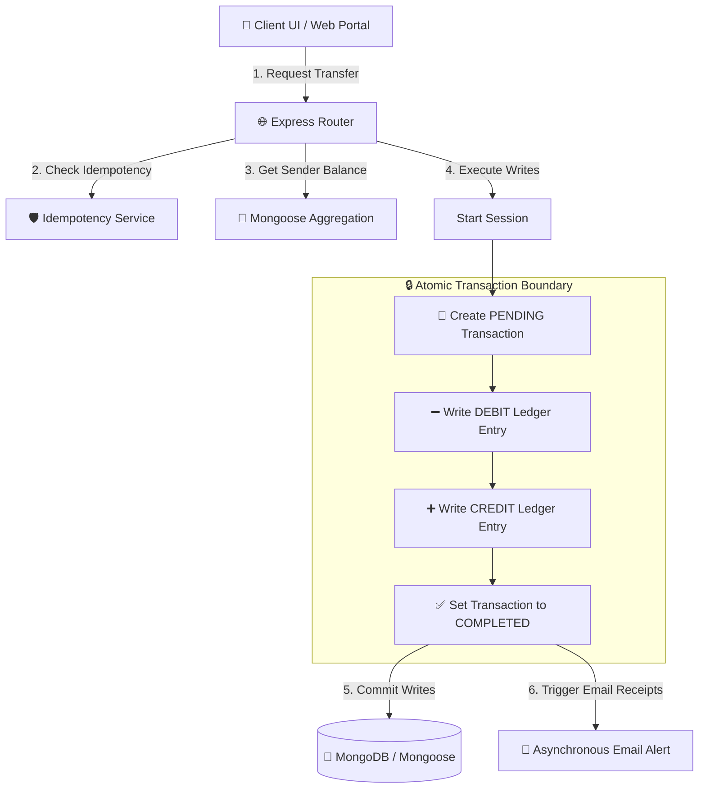

# 🏦 NexBank — Digital Ledger & Premium Banking Hub

NexBank is a next-generation digital banking platform featuring a **premium glassmorphism theme**, instant atomic transfers, and a rock-solid **double-entry ledger engine** built on Node.js/Express, MongoDB/Mongoose, and Next.js (React).

By utilizing double-entry bookkeeping principles, NexBank ensures that every rupee in circulation is mathematically accounted for, preventing balance mismatch discrepancies and database write leaks.

---

## 💎 Design Philosophy & Architecture

NexBank utilizes **Rich Glassmorphic Design Aesthetics** for an immersive user experience, coupled with a robust double-entry transactional ledger backend.



---

## ⚡ Key Architectural Features

### 1. 🧮 Double-Entry Ledger Bookkeeping

Traditional systems store user balances as single columns in an account table (e.g., `balance: 500`). This is highly susceptible to race conditions and dirty writes.
NexBank calculates balances **dynamically** by aggregating historic ledger entries:

- **DEBIT (➖)**: A ledger record subtracting funds from an account.
- **CREDIT (➕)**: A ledger record adding funds to an account.
- **Net Balance** = `Sum of CREDITs` - `Sum of DEBITs`.

### 2. 🛡️ Idempotency Engine

To prevent packet duplicate requests (e.g., users clicking "Send" twice on a slow network), every ledger transaction requires a client-generated UUID `idempotencyKey`. The backend records this key; subsequent requests return the cached transaction status immediately.

### 3. 🔒 Connection Leak Protection

Every database transactional write session uses a resilient `try/catch/finally` harness. In case of unexpected server crashes, it executes a complete transaction rollback (`session.abortTransaction()`) and strictly ends the session (`session.endSession()`) to release MongoDB connection pool handles.

### 4. 📧 Asynchronous Notifications

Upon successful execution, the backend fires asynchronous, non-blocking email alerts to verify transactions to clients without adding latency to the main API thread response.

---

## 📂 Project Directory Structure

```text
13-Backend-Ledger/
├── server/                     # 🌐 Express.js Backend Server
│   ├── src/
│   │   ├── config/             # Database & environment configurations
│   │   ├── controllers/        # Transaction, account & authentication controllers
│   │   ├── middleware/         # Session security guards & auth filters
│   │   ├── models/             # Mongoose Schemas (User, Account, Ledger, Transaction)
│   │   ├── service/            # Nodemailer SMTP Email receipt microservices
│   │   └── app.ts              # Express Server core configuration
│   ├── package.json
│   └── tsconfig.json
├── web/                        # 💻 Next.js Client Web App
│   ├── app/                    # Next.js Pages (Landing, Dashboard, Forms, Admin)
│   ├── components/             # Reusable Glassmorphism Cards & Buttons
│   ├── context/                # Global User Auth State Providers
│   ├── hooks/                  # Custom hooks (useAccounts, useTransfer, useAuth)
│   ├── lib/                    # API client configurations (Axios & endpoints)
│   ├── types/                  # TypeScript interface descriptors
│   ├── public/                 # Static asset public resources
│   └── package.json
└── README.md                   # 📄 Project Master Document
```

---

## 🧪 Database Models (Mongoose Schemas)

### 👤 User Model

Manages registered bank accounts, securely hashing passwords, and tagging administrator levels.

```typescript
{
  name: { type: String, required: true },
  email: { type: String, required: true, unique: true },
  password: { type: String, required: true },
  systemUser: { type: Boolean, default: false } // Admin privileges
}
```

### 💳 Account Model

Represents distinct currency bank accounts owned by users. Calculates balances dynamically from the ledger.

```typescript
{
  user: { type: ObjectId, ref: "user", required: true },
  status: { type: String, enum: ["ACTIVE", "FROZEN", "CLOSED"], default: "ACTIVE" },
  currency: { type: String, default: "INR" }
}
```

### ➖ Ledger Entry Model

Individual journal entries recording credits and debits linked to transactions.

```typescript
{
  account: { type: ObjectId, ref: "account", required: true },
  type: { type: String, enum: ["DEBIT", "CREDIT"], required: true },
  amount: { type: Number, required: true },
  transaction: { type: ObjectId, ref: "transaction", required: true }
}
```

### 📝 Transaction Model

The header/envelope tracking transaction flow metadata.

```typescript
{
  fromAccount: { type: ObjectId, ref: "account", required: true },
  toAccount: { type: ObjectId, ref: "account", required: true },
  amount: { type: Number, required: true },
  idempotencyKey: { type: String, required: true, unique: true },
  status: { type: String, enum: ["PENDING", "COMPLETED", "FAILED", "REVERSED"], default: "PENDING" }
}
```

---

## 🚀 Step-by-Step Installation & Run Guide

### Prerequisite Environment Configurations

#### Backend Server (`server/.env`)

Create a `.env` file under the `server` directory:

```env
PORT=5000
MONGODB_URI=mongodb+srv://<username>:<password>@cluster.mongodb.net/ledger_db
JWT_SECRET=your_jwt_signing_secret_key

# Nodemailer SMTP Configuration
EMAIL_HOST=smtp.gmail.com
EMAIL_PORT=587
EMAIL_USER=your-email@gmail.com
EMAIL_PASS=your-app-password
```

#### Frontend Client (`web/.env`)

Create a `.env` file under the `web` directory:

```env
NEXT_PUBLIC_API_URL=http://localhost:5000/api
```

---

### Command Sequence

#### 🌐 Running the Backend Server

```bash
# Navigate to backend
cd server

# Install dependencies
npm install

# Compile TypeScript and Run server in development mode
npm run dev

# Build production bundle
npm run build
```

#### 💻 Running the Next.js Client

```bash
# Navigate to web
cd web

# Install dependencies
npm install

# Run the client in development mode
npm run dev

# Build production compiled bundle
npm run build
```

---

## 🔒 Security Operations

1. **Password Integrity**: Client-side forms evaluate password entropy using a 4-tier real-time complexity bar.
2. **Access Guards**: Routes and actions are wrapped with a `ProtectedRoute` component to intercept unauthenticated users.
3. **Admin Controls**: Administrative functions (direct ledger balance injection/minting) are protected by a `systemUser` DB check.

---

_Built with passion, robust ledger arithmetic, and premium digital aesthetics._ 🏦💎
